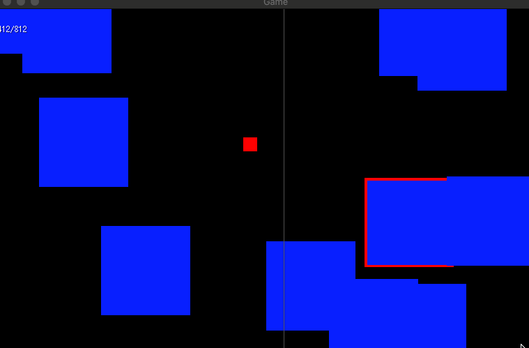

# Overview

In theory, this project should become a multiplayer game written in Go with [ebiten](https://ebiten.org/). In practice, I want
to develop a simple multiplayer game and ebiten's (actuall non-existing) physics engine makes the development of a lot of basic
stuff such as collision detection etc. necessary. While it works, i.e. this is a simple engine with Gamepad support, raycasting
and collision detection

it is rather cumbersome given **my target of developing the game and not the engine itself**. After researching and playing around a bit, 
I'm switching to [Godot](https://godotengine.org/) and document my progress in a new repository.